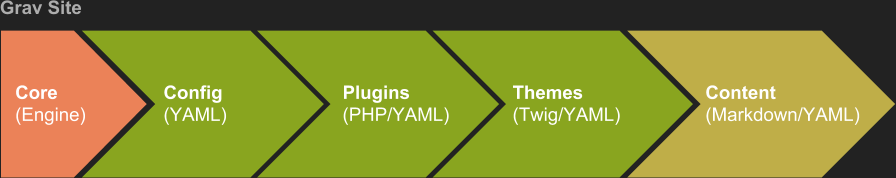

### Delivering a Better Experience by Using the Open, Collaborative and Flexible Grav CMS <br>– Inside or Outside of your LMS<br><br>
##### Paul D Hibbitts<br>[hibbittsdesign.org](https://hibbittsdesign.org/blog)<br>[@hibbittsdesign](https://twitter.com/hibbittsdesign)

---

### @fa[rocket] Topics to Explore Today @fa[rocket]
1. What is Grav?
2. Grav Open Course Hub Project
3. Other Open-related Grav Projects
4. Next Steps

---?color=#8fa33b

### What is Grav?

---?image=assets/img/getgrav.png&size=contain&color=black

---?image=assets/img/getgrav-2.png&size=contain&color=black

---

### Grav Highlights

- File-based
    - Fast performance (esp. smaller sites), simplicity, portability and generally more secure
    - File-based content also naturally supports version control
    - Grav can also be a front-end for any collaborative Git repository
- Markdown
    - A platform-independent format perfect for writing and the 5Rs

---

### Grav Highlights

- Modular
    - Modular content is possible, along with custom content types
- Workflow
    - Supports an efficient edit and publish workflow (esp. Git-based)
- Customization
    - Powerful Blueprints supports Admin Panel customizations

---

### Grav’s Layered Conceptual Design



---?color=#8fa33b

### Open Course Hub Project

---

### Grav Open Course Hub
Built using Grav, Open Course Hub with Git Sync is designed to give tech-savvy educators an open, collaborative and flexible platform that they can partner with their current LMS

---

### Grav Open Course Hub

@ul[squares]

- Streamlined setup and configuration (incl. Git Sync)
- Supports open and collaborative content (via Git repository)
- Theme files synced to Git repository for collaborative authoring/assistance
- Example course hubs (incl. basic, intermediate. and advanced)
- Includes custom content type pages and Shortcodes (i.e. Embed.ly Web page preview cards, H5P and Swipe)
- Fully customizable Sidebar using Markdown or HTML

@ulend

---?image=assets/img/grav-open-course-hub-skeleton-1.png&size=contain&color=#777777

---?image=assets/img/grav-open-course-hub-skeleton-2.png&size=contain&color=#000000

---?image=assets/img/grav-open-course-hub-skeleton-3.png&size=contain&color=#000000

---?image=assets/img/grav-open-course-hub-skeleton-4.png&size=contain&color=#777777

---?image=assets/img/grav-open-course-hub-skeleton-5.png&size=contain&color=#000000

---?image=assets/img/grav-open-course-hub-skeleton-6.png&size=contain&color=#000000

---?image=assets/img/grav-open-course-hub-skeleton-7.png&size=contain&color=#000000

---?image=assets/img/grav-open-course-hub-skeleton-8.png&size=contain&color=#000000

---?image=assets/img/grav-open-course-hub-skeleton-9.png&size=contain&color=#777777

---?image=assets/img/grav-open-course-hub-skeleton-10.png&size=contain&color=#000000

---?image=assets/img/grav-open-course-hub-skeleton-11.png&size=contain&color=#000000

---

### @fa[laptop] What Skills are Required? @fa[laptop]

@ul[squares]

- Intended for “Tech-savvy” educators:
 - Code editor usage (e.g. Atom or Brackets)
 - Markdown or HTML basics
 - Understanding folder hierarchies (i.e. relative links)
 - Web server access
 - GitHub working knowledge (recommended)

@ulend

---

### Grav Open Course Hub is Intended for Tech-savvy Educators who Value:

- Controllability
- Flexibility
- Portability
- Efficiency
- Openness
- Participation

---?image=assets/img/grav-open-course-workflow-1.png&size=contain&color=white

---?image=assets/img/grav-open-course-workflow-2.png&size=contain&color=white

---?image=assets/img/grav-open-course-workflow-3.png&size=contain&color=white

---?image=assets/img/grav-open-course-workflow-4.png&size=contain&color=white

---

### Problems the Course Hub Tackles

- Pedagogical goals that are unmet by the current LMS
- Student and facilitator experiences, especially multi-device, are below expectations
- Ability to access, share and collaboratively edit course materials is lacking
- The creation and (often frequently needed) updating of online course materials is too time consuming
- Once created, online course materials are difficult to repurpose on different platforms for different contexts
- Unable to leverage existing Web authoring skills or standards on the current Learning Platform

---

### @fa[comment] What are Users Saying? @fa[comment]

---

> “The Open Course Hub was easy to set up and get running and my students loved having a one-stop place to go to for their course content. I really love that it syncs with GitHub so easily and seamlessly. I was able to have an open, collaborative, easily updatable, fully version-controlled site up and running in little time, with fairly modest technical skills. On the student side, it is all beautiful and easy to use on any device!”
-- Mark Coster (Associate Professor at Griffith University, Australia)

---

> “The Open Course Hub project provides a series of excellent resources for integrating Grav with Canvas, as well as documentation and examples which make them a joy to work with. It is quick to set up, easy to use, and especially with the Git Sync plugin shows the power of a modern approach to integrated CMS-LMS solutions. The large and complex architecture of Canvas is complemented by the relative simplicity of Grav, and the Open Course Hub demonstrates this well.”
-- Ole Vik (Research Assistant at the University of Bergen, Norway and Grav Plugin Developer)

---

### Enough Talk, Demo Time!  

#### [demo.hibbittsdesign.org/cmpt-363-173/](http://demo.hibbittsdesign.org/cmpt-363-173/)

---

### Wait, What about _Inside_ of<br> an LMS?
#### [canvas.sfu.ca/courses/35900](https://canvas.sfu.ca/courses/35900)

---?color=#8fa33b

### What About Other Open-related Grav Projects?

---

### More Open-related Grav Projects

- Open Publishing Space
    - Share and collaboratively edit Markdown-based OER
- Learn2 with Git Sync
    - Share and collaboratively edit Markdown-based documentation
- H5P Shortcode
    - Display H5P.org and locally store H5P content
- Hypothesis Plugin
    - Display the Hypothesis sidebar on your Grav site

---?color=#FFFFFF

### @color[black](Open Publishing Space)

---?image=assets/img/grav-open-publishing-space.png&size=auto 60%&position=bottom

---?color=#FFFFFF

### @color[black](Learn2 with Git Sync)


---?color=#FFFFFF

### @color[black](H5P Shortcode)

```
[h5p id="712"]
[h5p url="https://h5p.org/h5p/embed/712"]
```


---?color=#FFFFFF

### @color[black](Hypothesis Plugin)


---?color=#8fa33b

### Next Steps

---

### Things to Explore Next

Grav CMS Official Site  
[getgrav.org](https://getgrav.org)  

Markdown  
[Learn the basics of Markdown in ten minutes](https://designedbywaldo.com/en/tools/markdown-tutorial)  

GitHub Workflow  
[Introduction - Git and GitHub for Poets](https://www.youtube.com/watch?v=BCQHnlnPusY&index=1&list=PLRqwX-V7Uu6ZF9C0YMKuns9sLDzK6zoiV)  
[GitHub Desktop App](https://desktop.github.com/)  

---

### @fa[exclamation-triangle] Pop Quiz @fa[exclamation-triangle]
Which of these “tech-savvy” skills concern you the most?
 - Text editor usage (e.g. Atom or Brackets)
 - Markdown or HTML basics
 - Understanding folder hierarchies (i.e. relative links)
 - Web server access
 - GitHub or GitLab working knowledge
 - GitHub Desktop App (not needed if using Atom)

---

### @fa[star] Thank you. Q&A Time! @fa[star]

**Contact Info**  
Blog: [hibbittsdesign.org](http://hibbittsdesign.org/blog)  
Twitter: [@hibbittsdesign](https://twitter.com/hibbittsdesign)  
Email: [paul@hibbittsdesign.org](mailto://paul@hibbittsdesign.org)  

**Grav Open Course Hub**  
Docs: [learn.hibbittsdesign.org/coursehub](http://learn.hibbittsdesign.org/coursehub)  
Canvas Demo: [demo.hibbittsdesign.org/canvascoursehub](http://demo.hibbittsdesign.org/canvascoursehub)  
Moodle Demo: [demo.hibbittsdesign.org/moodlecoursehub](http://demo.hibbittsdesign.org/moodlecoursehub)  
